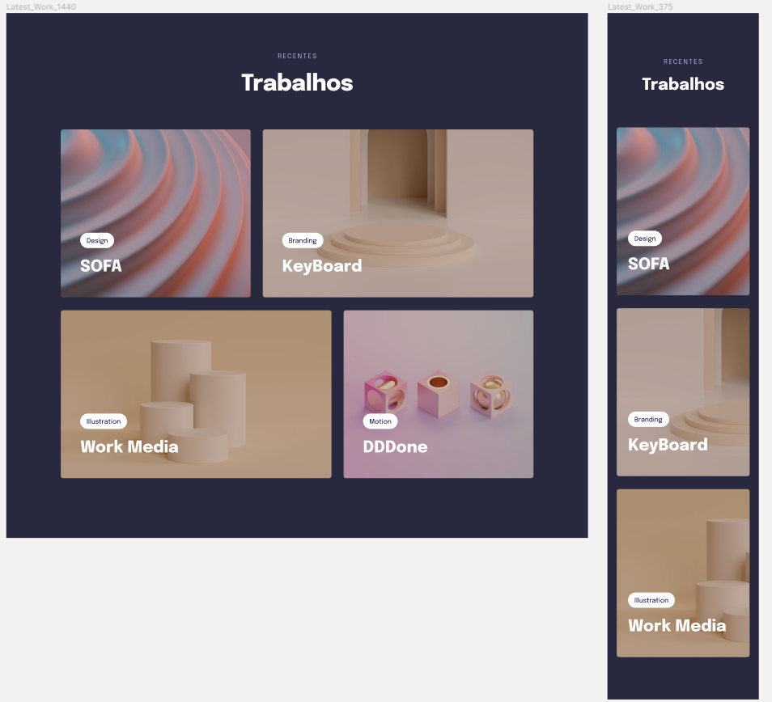

  

## 🖥️ Projeto
 Recentes Trabalhos  

## ✍️ Aprendizagem

* Variáveis e cores HSl no CSS
* Estilizando o header
* Definindo largura máxima e alinhando o contéudo
* Encaixando a imagem e sobrepondo o texto 
* Finalizando os cards
* Transições e transformações
* animações com CSS
* Versão Desktop com grid 
* Adicionando filtros em imagens com CSS
* Ajustando textos com CSS clamp
 

## 🚀 Tecnologias
Esse projeto foi desenvolvido durante o EXPLORER- programação web da Rocketseat com as seguintes tecnologias:

* HTML
* CSS

## 🏷️ Layout
Você pode visualizar o layout do projeto através 
[desse link](https://www.figma.com/file/bZsw9nNikVbPnM5JYcpDnU/Explorer-Stage-03-Projeto-03-(Copy)?type=design&node-id=203%3A1865&t=DaxASeJJZXeXpAdB-1). 
É necessário ter uma conta no [Figma](https://www.figma.com)

Feito com ❤️ por <strong>Luciana</strong>. Me acompanhe nas [redes sociais!](https://luciana-maria.github.io/Cartao-de-visita-Rocketseat/)
